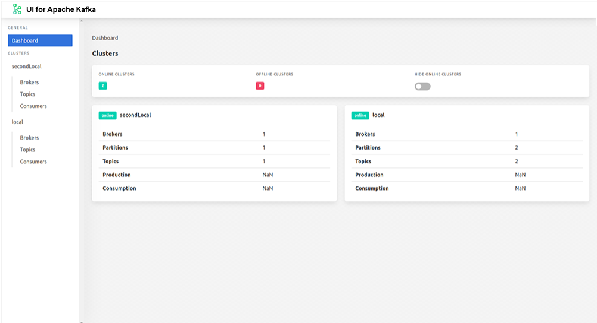

 UI for Apache Kafka – Free Web UI for Apache Kafka &nbsp; 
------------------


<em>UI for Apache Kafka is a free, open-source web UI to monitor and manage Apache Kafka clusters. </em> 

UI for Apache Kafka is a simple tool that makes your data flows observable, helps find and troubleshoot issues faster and deliver optimal performance. Its lightweight dashboard makes it easy to track key metrics of your Kafka clusters - Brokers, Topics, Partitions, Production, and Consumption. 

Set up UI for Apache Kafka with just a couple of easy commands to visualize your Kafka data in a comprehensible way. You can run the tool locally or in the cloud. 




# Features
* **Multi-Cluster Management** — monitor and manage all your clusters in one place
* **Performance Monitoring with Metrics Dashboard** —  track key Kafka metrics with a lightweight dashboard
* **View Kafka Brokers** — view topic and partition assignments, controller status
* **View Kafka Topics** — view partition count, replication status, and custom configuration
* **View Consumer Groups** — view per-partition parked offsets, combined and per-partition lag
* **Browse Messages** — browse messages with JSON, plain text, and Avro encoding
* **Dynamic Topic Configuration** — create and configure new topics with dynamic configuration
* **Configurable Authentification** — secure your installation with optional Github/Gitlab/Google OAuth 2.0
---
### Getting started
* kafka SSL secrets config

```yaml
    kafka:
      # zkcertsLocation: /etc/kafka/certs
      # zkcertsSecret: my-zk-secret
      # zktruststoreItem: truststore.p12
      # zkkeystoreItem: keystore.p12
      truststoreFileLocation: /etc/kafka/truststore
      keystoreFileLocation: /etc/kafka/keystore
      truststoreSecret: demo-kafka-cluster-ca-cert
      keystoreSecret: my-keystore-secret
      truststoreItem: ca.p12
      keystoreItem: user.p12
```
`in the above block the only thing that need to be customized is the truststore/keystore secret name`

---

* kafka-ui to kafka cluster configurations
```yaml
envs:
  config: 
    KAFKA_CLUSTERS_0_NAME: "sut-kafka"
    KAFKA_CLUSTERS_0_BOOTSTRAPSERVERS: 'https://kakfa-bootstrap-servers:1234'
    KAFKA_CLUSTERS_0_PROPERTIES_SECURITY_PROTOCOL: SSL
    KAFKA_CLUSTERS_0_PROPERTIES_SSL_KEYSTORE_LOCATION: "/etc/kafka/keystore/user.p12"
    KAFKA_CLUSTERS_0_PROPERTIES_SSL_KEYSTORE_PASSWORD: "jAkhncrqsrgs"
    KAFKA_CLUSTERS_0_PROPERTIES_SSL_TRUSTSTORE_LOCATION: "/etc/kafka/truststore/ca.p12"
    KAFKA_CLUSTERS_0_PROPERTIES_SSL_TRUSTSTORE_PASSWORD: "M7E5g37nB04X"
```

`#3 set the cluster name `

`#4 set the endpoint of the kafka bootstrap servers `

`#5 set the kafka security protocol (currently only SSL is supported) `

`#6 set the kafka keystore location (use the 2 values of $keystoreFileLocation/$keystoreItem )`

`#7 set the kafka keystore password (export from the openshift secret) `

`#8 set the kafka truststore location (use the 2 values of $truststoreFileLocation/$truststoreItem )`

`#9 set the kafka truststore password (export from the openshift secret) `

---

* auth-proxy config

```yaml
auth:
#set to false in order to disable the authentication proxy side car
  enabled: true
#select the target address where to be redirected after authentication must contain protocol name (http/https) in case its not a domain name it ust include port number
  upstream: 'http://{{ include "kafka-ui.fullname" . }}:80'
#set as true if you need to use email domain authentication
  useEmailDomain: true
#select the mail domain to be allowed for authentication
  emailDomain: redhat.com
#set true if you need to use role based authentication
  useSar: true
#select the resource where access is needed for a user to it in order to be able to bypass the proxy
#  "namespace":"app-dev","resource":"services","name":"proxy","verb":"get"}
  resource:
    namespace: "nemer-amq"
    kind: "services"
    name: city-bank-kafka-ui
    verb: get
#select cookie secret name must be 16 bytes or 24 or 32
  cookieSecretName: SECRET1234567890123456
#cookie saving refresh rate in seconds
  cookieRefreshSec: 20
#number of replicas for the deployment
  replicas: 1
#list of labels to add to all resources e.g:
  # labels:
  #   - 'someLabelName: someLabelValue'
  #   - 'someOtherLabelName: someOtherLabelValue'
  labels:
    - 'app: proxy'
```

`you can use SAR based authenticatio or/and domain-name authentication`

---
#### installation
`fter all values got customized then the only thing left for installation as applying the chart`

    #RUN:
    	helm install [$CUSTOM_CHART_NAME] $PATH_TO_CHART
